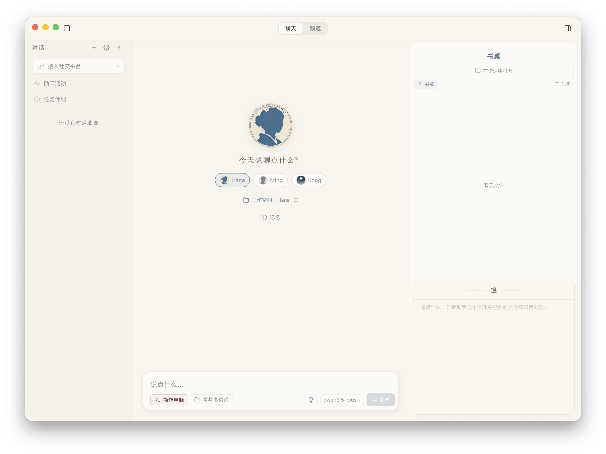

<p align="center">
  
</p>

<p align="center">
  
</p>

<h1 align="center">LingxiAgent</h1>

<p align="center">A personal AI agent with memory and soul</p>

<p align="center"><a href="README.md">中文版</a></p>

[](LICENSE)


---

## What is LingxiAgent

LingxiAgent is a personal AI agent that is easier to use than traditional coding agents. It has memory, personality, and can act autonomously. Multiple agents can work together on your machine.

As an assistant, it is gentle: no complex configuration files, no obscure jargon. LingxiAgent is designed not just for coders, but for everyone who works at a computer.
As a tool, it is powerful: it remembers everything you've said, operates your computer, browses the web, searches for information, reads and writes files, executes code, manages schedules, and can even learn new skills on its own.

## Upstream Project

LingxiAgent is developed on top of [openhanako](https://github.com/liliMozi/openhanako) and is a derivative of it.

openhanako provides a solid Agent runtime foundation: a complete agent framework, session and memory systems, and a tool and sandbox model. On top of that, LingxiAgent has been rebranded from HanaAgent to Lingxi, started its own 0.1.x version line, and added a great deal of productization tailored for everyday office scenarios, while continuously syncing upstream updates.

Our sincere thanks go to [openhanako](https://github.com/liliMozi/openhanako) and its developers: without their years of engineering and openness, LingxiAgent would not exist today.

## Features

**Memory** — A custom memory system that keeps recent events sharp and lets older ones fade naturally.

**Personality** — Not a generic "AI assistant". Each agent has its own voice and behavior through personality templates. Agents are self-contained folders, easy to back up and manage.

**Tools** — Read/write files, run one-shot commands or persistent terminal sessions, browse the web, search the internet through browser-backed or API providers, take screenshots and segmented long screenshots, preview media, and inspect pages. Covers the vast majority of daily work scenarios. A server-first CLI can also attach to the same LingxiAgent Server to show status, list sessions, and continue chats from a terminal.

**Skills** — Built-in compatibility with the community Skills ecosystem. Agents can also install skills from GitHub or write their own. Strict safety review enabled by default.

**Character Cards & Skill Bundles** — Export and import agents as local-first character-card zip packages with allowlisted identity, avatar, optional memory, and skills. Skill Bundles are separate skill-pack infrastructure: group skills, drag them between bundles, toggle a whole bundle for an agent, and export a bundle as a standalone zip for migration or sharing.

**Multi-Agent** — Create multiple agents, each with independent memory, personality, and scheduled tasks. Agents can collaborate via channel group chats or delegate tasks to each other.

**Desk** — Each agent has a desk for files and notes (Jian). Supports drag-and-drop, file preview, and workspace file-tree change watching, serving as an async collaboration space between you and your agent.

**Full-Screen Media Viewer** — Click any image, SVG, or video from chat or the desk to open a dark-overlay viewer with wheel-zoom, drag-to-pan, `+` / `−` / `0` shortcuts, and left/right navigation between sibling media in the same session or folder.

**Session Management** — The sidebar can search chat history, prioritizing title matches and then searching message content. Old sessions can be archived, restored, or permanently deleted from settings. Selecting text in a chat message turns it into a composer quote card so follow-up questions keep the original context.

**Cron & Heartbeat** — Agents can run scheduled tasks and periodically check for file changes on the desk. The current automation executor separates "when to run" from "what to do": complex tasks still run as background Agent sessions, lightweight reminders can send direct notifications, and plugin actions can be scheduled too.

**Sandbox** — Two-layer isolation: application-level PathGuard with four access tiers + OS-level sandboxing (macOS Seatbelt / Linux Bubblewrap / Windows restricted token). Agents can read ordinary system files, while writes and deletes stay limited to the workspace and managed data folders. On Windows, the command sandbox is a write-isolation model: reads use the current user's normal permissions, and network access keeps the current user's network permissions. macOS and Linux continue to use the network behavior provided by their platform sandbox backends. External network access can use system proxy, manual proxy, or direct mode.

**Plugins** — Extensible plugin system with a convention-first architecture. Install community plugins by drag-and-drop. Plugins can contribute tools, skills, commands, agent templates, HTTP routes, Pi SDK extensions, LLM providers, pages, widgets, configuration schemas, and background tasks. Routes have direct access to core services (PluginContext injection) and can interact with agent sessions via the Session Bus; plugin cards flow through the same message-block and history replay pipeline as built-in cards. The two-level permission model (restricted / full-access) keeps advanced surfaces safe: `extensions/`, routes, providers, pages, and lifecycle hooks only load for full-access plugins.

**Multi-Platform Bridge** — A single agent can connect to Telegram, Feishu, QQ, and WeChat bots simultaneously. Chat from any platform and remotely operate your computer. Bridge sessions carry platform context, and notifications can be delivered back to the current external platform.

**Mobile & LAN Frontends** — LingxiAgent Server can host the `/mobile/` PWA. Phones can sign in with a device access key or local account, view sessions, chat, and manage workbench files. Another desktop frontend can also connect to an existing LAN LingxiAgent Server with a LAN URL and access key.

**i18n** — Interface available in 5 languages: Chinese, English, Japanese, Korean, and Traditional Chinese.

## Screenshots

<p align="center">
  
</p>

## Quick Start

### Download

**macOS (Apple Silicon / Intel):** download the matching `.dmg` from the [Releases page](https://github.com/ItsDalk-Lane/LingxiAgent/releases).

The macOS CI build supports Developer ID signing and notarization. Without the corresponding credentials, CI uses ad-hoc signing and skips notarization. Check the downloaded artifact and its release notes for that version's signing and notarization status. Gatekeeper may block an ad-hoc build on first launch.

**Windows:** download the matching `.exe` installer from the [Releases page](https://github.com/ItsDalk-Lane/LingxiAgent/releases).

> **Windows SmartScreen notice:** The build workflow supports a Windows code-signing certificate. Unsigned installers or installers without established reputation may trigger SmartScreen. Check the downloaded artifact for its signing status.

**Linux:** download the matching `.AppImage` or `.deb` from the [Releases page](https://github.com/ItsDalk-Lane/LingxiAgent/releases).

### First Run

On first launch, the onboarding wizard guides you through choosing a language, entering user and agent names, connecting a provider, adding available models, selecting one **chat model**, and choosing a workspace. Later, Settings → Models lets you configure auxiliary models for title / naming, summarization, memory, knowledge analysis, vision, approval, and security review. Enabling vision assistance lets text-only chat models work with image attachments through Vision Bridge. LingxiAgent supports OpenAI-compatible providers, Anthropic-style providers, OAuth providers, and local models via Ollama.

Available OAuth sign-in options are listed on the providers settings page.

## Architecture

```
core/           Engine orchestration + Managers (including PluginManager)
lib/            Core libraries (memory, tools, sandbox, bridge adapters)
server/         Hono HTTP + WebSocket server (standalone Node.js process)
cli/            Command-line entrypoint connecting to the server
hub/            Scheduler, ChannelRouter, EventBus
desktop/        Electron app + React frontend
shared/         Cross-layer utilities (config schema, error bus, model refs)
packages/       npm workspaces (plugin protocol, SDK, runtime, components)
plugins/        Built-in system plugins (bundled into app)
skills2set/     Built-in skill definitions
scripts/        Build tools (server bundler, launcher, signing)
tests/          Vitest test suite
```

The engine layer coordinates multiple managers (Agent, Session, Model, Preferences, Skill, Channel, BridgeSession, Plugin, etc.) and exposes them through a unified facade. The Hub handles background tasks (heartbeat, automation / cron, channel routing, agent messaging, DM routing) independently of the active chat session.

User-visible files inside a session are registered through `SessionFile` sidecars. Desktop, Bridge, Mobile PWA, and other remote frontends consume the same file identity according to their own capabilities. Each Bridge adapter explicitly declares its supported media kinds, delivery modes, and size limits; plugin file contribution rules live in `PLUGINS.md`.

Local staged files are uploaded directly by platform adapters when possible: Telegram / Feishu / WeChat use their native upload flows, and QQ uses the official bot chunked-upload flow before sending `msg_type: 7` rich media. `preferences.bridge.mediaPublicBaseUrl` / `LINGXI_BRIDGE_PUBLIC_BASE_URL` are only for consumers or fallback paths that still require an internet-reachable URL.

The server runs as a standalone Node.js process (spawned by Electron or independently), bundled via Vite with @vercel/nft for dependency tracing. It communicates with the Electron renderer through WebSocket.
User data is rooted at `LINGXI_HOME`, defaulting to `~/.lingxi` in production. The project's `npm start`, `npm run start:vite`, `npm run server`, and `npm run cli` commands use the development launcher, which sets `LINGXI_HOME` to `~/.lingxi-dev` and overrides an incoming value. Lingxi-managed Pi SDK runtime resources live under `${LINGXI_HOME}/runtime/pi-sdk/`; Lingxi does not rely on Pi's global agent directory or `PI_CODING_AGENT_DIR`.

## Tech Stack

| Layer | Technology |
|-------|-----------|
| Desktop | Electron 42 |
| Frontend | React 19 + Zustand 5 + CSS Modules |
| Build | Vite 7 |
| Server | Hono + @hono/node-server |
| Agent Runtime | [Pi SDK](https://github.com/badlogic/pi-mono) |
| Database | better-sqlite3 (WAL mode) |
| Testing | Vitest |
| i18n | 5 languages (zh / en / ja / ko / zh-TW) |

## Platform Support

| Platform | Status |
|----------|--------|
| macOS (Apple Silicon) | Supported |
| macOS (Intel) | Supported |
| Windows | Beta |
| Linux | Supported (AppImage / deb) |
| Mobile (PWA) | v0: phone sessions and workbench access through the same LingxiAgent Server |

## Development

Use Node.js `>=24.12.0 <25` and its compatible npm. See [Contributing](CONTRIBUTING.md) for platform build tools required by native dependencies.

```bash
# Install dependencies and run postinstall scripts
npm install

# Build workspace packages (fresh checkout or package source changes)
npm run build:packages

# Start with Electron (builds renderer first)
npm start

# Vite HMR: terminal A
npm run dev:renderer
# Vite HMR: terminal B
npm run start:vite

# Server only
npm run server

# Server-first CLI
npm run cli

# Run tests
npm test

# Type check
npm run typecheck
```

### Packaging and Releases

`npm run pack` builds a local application directory. `npm run dist`, `npm run dist:win`, and `npm run dist:linux` produce installers for their respective platforms. These commands build and verify a signed seed; prepare the [packaging environment](CONTRIBUTING.md#打包环境) first. The `build.publish` setting in `package.json` points to [ItsDalk-Lane/LingxiAgent](https://github.com/ItsDalk-Lane/LingxiAgent), whose Releases are the source for distribution and automatic updates. A local build is not a published release.

## Acknowledgments

- [liliMozi/openhanako](https://github.com/liliMozi/openhanako): the upstream project of LingxiAgent; this project is built on top of it, and we owe it our sincere gratitude.
- [tw93/kami](https://github.com/tw93/kami): the progressive-disclosure structure of the beautify plugin's HTML aesthetic guide (a router entry with flat on-demand sections) was inspired by this project.

## License

[Apache License 2.0](LICENSE)

## Links

- [Documentation Index](docs/README.md)
- [Security Policy](SECURITY.md)
- [Plugin Development](PLUGINS_EN.md)
- [Contributing](CONTRIBUTING.md)
