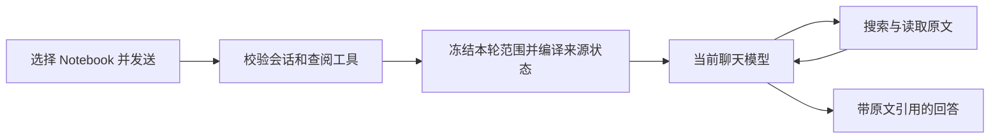

# 知识库执行链

2026-09-06 按当前源码核对。本文说明普通聊天的知识查阅入口；旧 P0–P3 任务报告保留其原阶段的实现和验收结果。

## 当前聊天如何查资料

选择 Notebook 后，发送时先冻结本轮资料范围，当前聊天模型通过 `knowledge_search`、`knowledge_read`、`knowledge_grep`、`knowledge_outline` 按需查阅并回答。发送准备阶段不预先搜索，也不因“详细”或“全部”等词自动启动独立研究。



生产提交入口是 [desktop-session-submit.ts](../../core/desktop-session-submit.ts) 的 `resolveKnowledgeInjectionBlock`，它调用 [engine.ts](../../core/engine.ts) 的 `buildConversationKnowledgeContext`。普通发送和插入发送复用这一准备逻辑。

[knowledge-refs.ts](../../shared/knowledge-refs.ts) 的网络输入仍接受 `auto`、`fast`、`detailed`，新请求统一归一为 `auto`。历史读取保留旧标签；[knowledge-execution.ts](../../shared/knowledge-execution.ts) 的兼容策略均指向 `conversation`，其中 `responseDetail` 不代表切换研究执行器。

## 范围、就绪状态与引用

- 范围只接受 Notebook。创建本轮范围时保存来源、内容快照和解析产物身份；同轮重试复用已有范围，不能替换 Notebook，也不能复活已关闭范围。见 [KnowledgeStore.createTurnScope](../../lib/knowledge/knowledge-store.ts) 与引擎的会话身份检查。
- [ScopeSnapshotCompiler](../../lib/knowledge/scope-snapshot-compiler.ts) 从持久化冻结事实编译可用索引。未解析、需 OCR、索引缺失或构建中等情况保留来源状态和 warnings；缺失索引可以入队后台构建。当前普通聊天准备链没有“任一来源未 READY 就整体拒绝”的旧版规则。归属错误、关闭范围或产物身份不匹配仍明确拒绝。
- 发送准备只注入范围目录和状态，初始 `retrievalMode` 为 `none`、证据列表为空，含义是尚未查阅，不能当作“没有证据”。缺少四个查阅工具中的任一个会在创建范围前报错。
- [knowledge_search](../../lib/tools/knowledge-search-tool.ts) 返回的原文 spans 与完整 `citationMarkdown` 可直接引用；标题、摘要和目录只作检索线索。需要上下文时继续 [读取](../../lib/tools/knowledge-read-tool.ts)、[原文查找](../../lib/tools/knowledge-grep-tool.ts)或[目录查阅](../../lib/tools/knowledge-outline-tool.ts)。普通聊天不要求把每段引文另交研究工具登记。
- `ContentSnapshot → ParseArtifact → Block → Chunk → Citation` 的来源关系仍须保留。检索命中不能证明整份资料已读完，超时、不可读内容和未核实范围都不能变成确定的否定结论。

## 旧实现与验证入口

[engine.ts](../../core/engine.ts) 中仍有 `buildFastKnowledgeContext`、`buildDetailedKnowledgeResearchContext`，仓库也保留研究工具及测试。方法存在不等于普通聊天仍从这些入口执行；修改时先沿提交链确认实际调用方。

[P0–P3 实施报告](../archives/knowledge-retrieval-research/KNOWLEDGE_REFACTOR_IMPLEMENTATION_REPORT.md)和[初版事实](../archives/knowledge-notebook/findings.md)分别记录不同阶段。重复的初版计划与进度已删除，恢复方法见[档案索引](../archives/README.md)。旧报告中的固定检索预算、无工具 worker、强制完整研究和全局 READY 拒绝条件不能直接作为当前聊天合同。

需要验证相关行为时，可选择现有检查：

```bash
npx vitest run tests/knowledge-execution-policy.test.ts tests/knowledge-conversation-context.test.ts tests/knowledge-fast-zero-remote.test.ts tests/knowledge-scope-snapshot-compiler.test.ts
```

这些检查覆盖策略、范围准备、提交和编译器边界；它们不代替真实付费模型质量、其他平台打包或发布验收。
