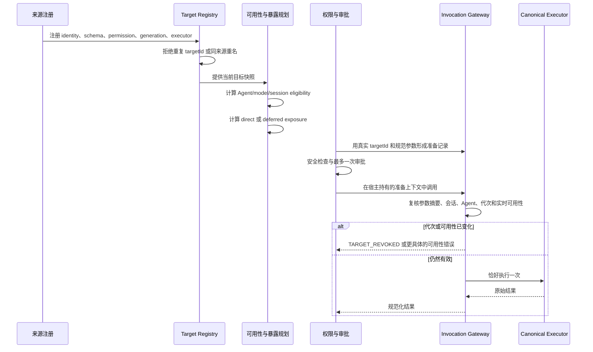
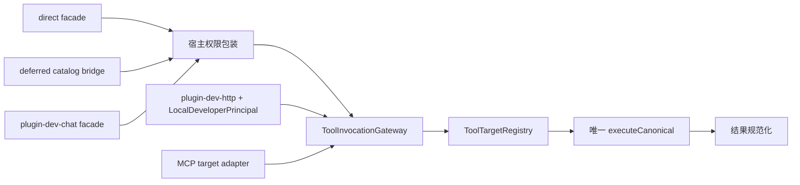

# 工具调用路径不变量

## 不变量

工具从哪个入口被找到，只决定“怎么找到它”，不能改变“它是谁、能做什么、要不要审批、最终执行什么”。在主体、宿主持有的会话身份、规范化目标、规范化参数、策略快照、生命周期代次和外部状态相同的前提下，经 `direct`、`deferred`、`plugin-dev-chat` 或本地开发者 `plugin-dev-http` 进入时，下列事实必须等价：

- 权限动作、权限级别、能力和副作用说明。
- 安全检查看到的真实工具名与真实参数。
- 审批次数和审批对象；一次调用最多审批一次。
- 参数摘要、会话、Agent、目标、代次和调用编号的绑定。
- 取消信号、流式更新回调、调用编号和规范执行器。
- 文本、结构化详情、应用卡片、来源信息和稳定错误码。
- 外部副作用次数；成功调用只能发生一次。

一句话理解：目录、开发工具和网络入口都是不同的“前台窗口”，仓库里只有一个“后厨”。窗口不能自己再做一遍菜。

## 身份与名称

| 名称 | 是什么 | 能否决定执行或授权 |
| --- | --- | --- |
| `targetId` | 工具目标的全局稳定主键，包含来源类型、来源和本名 | 可以；注册、准备、复核和执行都以它为准 |
| `capabilityBase` | 该目标拥有的能力命名空间，和动作组合成完整能力 | 可以；只能由注册身份声明，不能从显示名反推 |
| display name / label | 给人看的名称，可本地化，也可能重名 | 不可以 |
| catalog name | 目录中的兼容检索名，便于搜索和描述 | 不可以；必须继续解析成唯一 `targetId` |
| local / remote tool name | 来源内部使用的真实本名 | 只参与带来源的精确查找，不能单独当全局主键 |

同名工具可以来自不同插件或不同连接器。未带来源且命中多个目标时必须返回歧义；不得选择“第一个”。

## 生命周期时序

注册时的代次是会话装配快照。插件卸载、禁用、重载或连接器重连会推进当前代次。准备完成后只要代次变化，旧会话就不能继续用旧执行器。

## 统一调用路径

`deferred` 和 `plugin-dev-chat` 只允许把外层参数解析为真实目标引用，再交给同一个 Gateway。MCP Manager 和 Plugin Manager 只在批准的来源适配器底部接触原始执行接口。HTTP 开发入口不冒充会话或 Agent：它使用经过本机 owner 认证后生成的 `LocalDeveloperPrincipal`，并由 Gateway 自行准备和审批。

## PreparedInvocation 绑定

`PreparedInvocation` 是宿主在权限判断后保存的一次性事实快照，不进入模型参数，也不放进可序列化的普通运行上下文。它绑定：

- `targetId`
- `route`
- 规范化 `arguments` 和稳定 `argumentsDigest`
- `sessionId`、`sessionPath`
- `agentId`
- 规范化权限描述
- `lifecycleGeneration`
- `toolCallId`
- `createdAt`

执行前任一绑定事实变化都必须 fail-closed。文件交付等宿主安全证明不属于模型参数；Gateway 只接受宿主生成的精确证明，并在参数校验与摘要之后重新附着给真实执行器。

## Raw source adapter 边界

允许接触原始执行接口的文件必须是精确路径白名单：

| 原始边界 | 允许文件 |
| --- | --- |
| MCP `callTool` | `core/mcp/manager.ts`、`core/mcp/clients/http-client.ts` |
| Plugin `executePluginTool` | `core/plugin-dev-service.ts` |
| 注册目标 `executeCanonical` 调用 | `core/tool-invocation-gateway.ts` |

`scripts/check-tool-invocation-boundaries.mjs` 使用 TypeScript AST 扫描生产源码，`tests/tool-invocation-boundary.test.ts` 调用同一扫描函数，因此本地测试和独立门禁不会产生两套规则。白名单只能写精确文件，不能豁免整个目录。

## 错误码

| 错误码 | 含义 |
| --- | --- |
| `TARGET_NOT_FOUND` | 注册表中没有这个目标 |
| `TARGET_AMBIGUOUS` | 名称命中多个目标，必须补来源 |
| `TARGET_NOT_VISIBLE` | 当前表面不允许看到该目标 |
| `TARGET_DISABLED_FOR_AGENT` | 当前 Agent 明确禁用了该目标 |
| `TARGET_REVOKED` | 装配后的目标、连接或代次已经失效 |
| `PERMISSION_CONTRACT_MISSING` | 工具没有权限声明 |
| `PERMISSION_CONTRACT_CONFLICT` | 新旧权限声明互相冲突 |
| `PERMISSION_DENIED` | 权限解析器或审批明确拒绝 |
| `CAPABILITY_MISMATCH` | 声明能力不属于注册的 `capabilityBase` |
| `PREPARED_INVOCATION_MISSING` | 模型路径缺少宿主准备上下文 |
| `PREPARED_INVOCATION_MISMATCH` | 参数、主体、会话、目标、代次或调用编号发生替换 |
| `ARGUMENTS_NOT_OBJECT` | 参数不是有界普通对象 |
| `ARGUMENT_SCHEMA_INVALID` | 参数不符合完整 schema；详情带稳定 issue paths |
| `TOOL_SCHEMA_INVALID` | 注册的 schema 本身无效或无法执行 |
| `CREDENTIAL_PROVIDER_UNRESOLVED` | 找不到可用的凭证解析来源 |
| `CREDENTIAL_MISSING` | 解析来源存在，但没有所需凭证 |
| `TRANSPORT_FAILURE` | 执行或结果规范化的传输边界失败 |
| `EXECUTION_CANCELLED` | 调用在执行前、执行中或执行后被取消 |

媒体凭证刷新另外保留 `CREDENTIAL_REFRESH_CANCELLED`、`CREDENTIAL_REFRESH_TIMEOUT`、`CREDENTIAL_REFRESH_TRANSPORT_FAILED` 和 `CREDENTIAL_REFRESH_FAILED`，不能统称为“没有凭证”。模型可见错误会清除密钥、令牌和内部路径；诊断日志只记录 route、origin、targetId、sourceId、generation 和错误码。

## 新工具接入清单

1. 创建稳定 identity；确认来源、本名、公开名和 `capabilityBase` 没有从显示文本推导。
2. 声明唯一权限契约；读操作、副作用操作和审批说明与真实行为一致。
3. 提供完整、可消费的参数 schema，并为嵌套错误补稳定路径测试。
4. 明确 `deferrable`、`pinned`、装配时 eligibility 和实时可用性。
5. 提供当前 generation；卸载、禁用、重载和重连必须推进或撤销旧代次。
6. 只实现一个 canonical executor，并保持 `toolCallId`、取消信号和流式更新回调原样透传。
7. 注册到会话级 Registry，再由暴露规划决定 direct 或 catalog；不要把原始对象交给 Catalog。
8. 需要目录或开发入口时，只增加目标引用适配，不增加第二个执行器。
9. 为 direct/deferred/plugin-dev-chat 补路径变形测试；HTTP 另测本地主体、相同 schema、代次、身份和执行器。
10. 运行 `npm run check:tool-invocation-boundaries`、定向契约测试、全量测试和类型检查。

## 禁止重新引入的反模式

- 用 label、显示名或全局平面名称推导执行身份、能力或审批身份。
- 在 Engine 保存延迟工具的原始对象映射。
- 让 Catalog 保存执行器、原始工具对象或自行调用来源管理器。
- 让 Bridge 重新出现 `builtinCall`、`mcpCall` 或 `resolveBuiltinInvocation`。
- 在批准的精确来源适配器之外调用 raw plugin/MCP executor。
- 为 direct、deferred、plugin-dev 或 MCP 各复制一套 schema、权限、安全检查、生命周期或结果规范化逻辑。
- 把异常包装成普通成功文本，或把取消改写成传输失败。
- 把目标不存在、不可见、Agent 禁用、已撤销、凭证缺失和传输失败混成同一个错误。
- 把密钥、令牌、本机路径、原始不可信文本或内部堆栈写进模型可见消息。
- 为让测试变绿而删除、跳过、放宽断言，或把目录级白名单当作边界检查。
